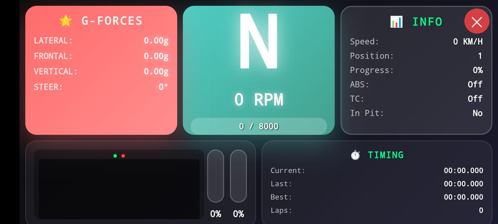

# AC Telemetry UI



It running using api from [angel-git/assetto-corsa](https://github.com/angel-git/assetto-corsa.git).

See [test video](https://youtu.be/N_TzZiofDfE?si=HXqpxVHnd6u3b3-n)

## Requirements
- Node.js
- npm
- Check out the API requirements at [angel-git/assetto-corsa](https://github.com/angel-git/assetto-corsa.git)

## Installation
1. Clone and navigate to project directory:
```bash
git clone https://github.com/yeftakun/ac-telemetry-frontend.git
cd ac-telemetry-frontend
```
2. Install dependencies:
```bash
npm install
```

## Run the application:
```bash
npm start
```
Then open http://localhost:3000
